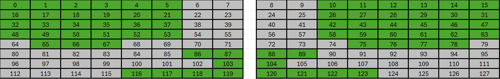

# Docs&Links
module doc https://zmk.dev/docs/development/hardware-integration/new-shield?keyboard-type=split&interconnect=pro_micro
Useful ZMK video https://www.youtube.com/watch?v=IIsZeWX2LEQ
homerow mod https://github.com/linkarzu/linkarzu-glove80/blob/main/config/glove80.keymap

ZMK List of keycodes: https://zmk.dev/docs/keymaps/list-of-keycodes

Keymap refs: 
ref https://github.com/linkarzu/zmk-keyboard-toucan/blob/main/boards/shields/toucan/toucan.keymap
klor https://github.com/GEIGEIGEIST/zmk-config-klor/blob/master/config/klor.keymap
glove80 https://github.com/linkarzu/linkarzu-glove80/blob/main/config/glove80.keymap


# TODO
- Update wiring pinout
- add layers
- Use - You switch between paired devices using &bt BT_SEL 0, &bt BT_SEL 1
- add Microcontroller wiring
- add Kanata companion configs - Windows & Linux
- add homerow mod
- Finish my_mt my_lt
- config combos - symbols, language change https://zmk.dev/docs/keymaps/combos
- add system layer - &bootloader, volume mb like https://github.com/beardage/adv360-config/blob/main/config/adv360pro.keymap
- add layer with F1..F12 keys like numppad + pinky 10 11 12
- check battery status? https://github.com/GEIGEIGEIST/zmk-config-klor/blob/master/config/boards/shields/klor/battery_status.h
- split files like //Local files #include <config/combos.dtsi>


# TODO transfer to Kanata

# Other useful WIP
For mouse 
```
#include <dt-bindings/zmk/mouse.h>
&mkp RCLK
```

# dtsi transform draft

// | SW01 | SW02 | SW03 | SW04 | SW05 | SW06 |  
// | SW07 | SW08 | SW09 | SW10 | SW11 | SW12 |
// | SW13 | SW14 | SW15 | SW16 | SW17 | SW18 |  
// | SW19 | SW20 | SW21 | SW22 | SW23 | SW24 | 
//        | SW25 | SW26 | SW27 | 
//                                           | SW28 | SW29 |
//                                                  | SW30 |
//                             | SW31 | SW32 | SW33 | SW34 |

# Microcontroller wiring
| Matrix | Pin label | ZMK reference |
| - | - | - |
| R0 | 009 | &pro_micro 10 |
| R1 | 010 | &pro_micro 16 |
| R2 | 111 | &pro_micro 14 |
| R3 | 113 | &pro_micro 15 |
| R4 | 115 | &pro_micro 18 |
| R5 | 002 | &pro_micro 19 |
| C0 | 106 | &pro_micro 9 |
| C1 | 104 | &pro_micro 8 |
| C2 | 011 | &pro_micro 7 |
| C3 | 100 | &pro_micro 6 |
| C4 | 024 | &pro_micro 5 |
| C5 | 022 | &pro_micro 4 |
| C6 | 020 | &pro_micro 3 |
| C7 | 017 | &pro_micro 2 |

# Homerow keys positions
